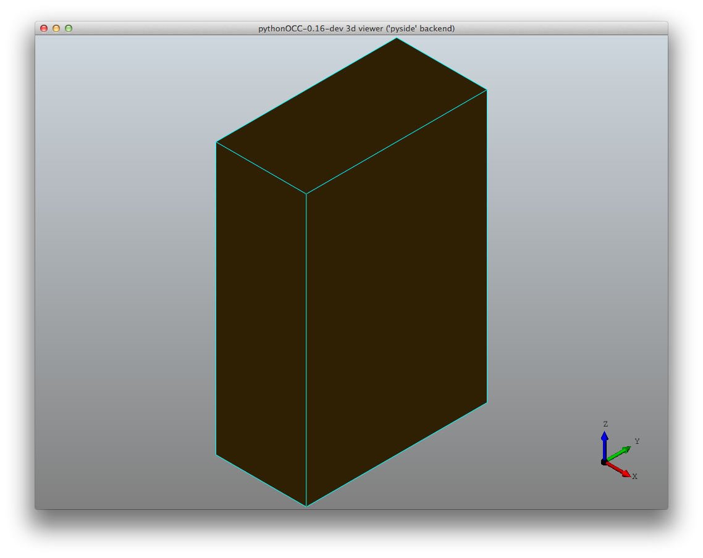

Helloworld !
============

Abstract
--------
This examples creates and displays a simple box.

Launch the example
------------------
How to lauch the example ::

  $ python core_helloworld.py

Output
------

Description
-----------
The first line loads the init_display function, necessary to enable the builtin
simple gui provided with pythonocc::
  
  from OCC.Display.SimpleGui import init_display

Then we import the class that instanciates a box::
  
  from OCC.BRepPrimAPI import BRepPrimAPI_MakeBox

Here the BRepPrimAPI module means Boundary Representation Primitive API. It provides an
API for creation of basic geometries like spheres, toruses, cones etc.

Following line initializes the display. By default, the init_display function looks
for a Qt based Gui (PyQt, PySide), then switch to wx if any::
  display, start_display, add_menu, add_function_to_menu = init_display()

The BRepPrimAPI_MakeBox class is initialized with the 3 parameters of the box: widht, height,
depth::

  my_box = BRepPrimAPI_MakeBox(10., 20., 30.).Shape()

Then the box shape is sent to the renderer::

  display.DisplayShape(my_box, update=True)

At last, we enter the gui mainloop::

  start_display()

That'as all!
