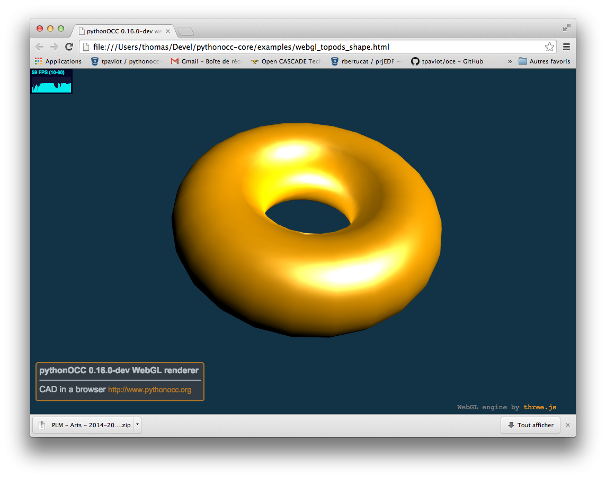

Affichage dans un navigateur Internet
=====================================

Résumé
------
Dans cet exemple, un tore est créé et affiché dans un nabigateur internet. C'est la
technologie WebGl, disponible depuis quelques mois dans les dernières versions des
navigateurs Chrome, FireFox ou Safari, qui permet la visualisation interactive de 
formes 3D dans la navigateur. Cette technologie évite l'installation de bibliothèques
graphiques (GUI) lourdes à installer et utiliser, de plus cet afichage se fait sans plugin.

Lancer l'exemple
----------------
Pour lancer le script ::

  $ python core_webgl_threejs_torus.py

Résultat
--------

Description
-----------
La première ligne permet d'importer la fonction permettant la création de l'interface
graphique rudimentaire fournie avec pythonocc. On la retrouvera chaque fois que l'on
souhaitera visualiser la géométrie créée.::
  
  from OCC.Display.SimpleGui import init_display

Le module BRepPrimAPI qui offre un ensemble de classe pour créer des sphères, tores, cylindres etc. Ici, c'est la classe BRepPrimAPI_MakeBox, permettant de créer des parallélépipèdes, qui est importée::

  from OCC.BRepPrimAPI import BRepPrimAPI_MakeBox

La ligne suivante initialise l'interface graphique. Par défaut, la fonction init_display
recherche les gestionnaire d'interface utilisateur PyQt, PySide, et en dernier lieu wxPython::
  
  display, start_display, add_menu, add_function_to_menu = init_display()

La classe BRepPrimAPI_MakeBox est initialisée à l'aide de 3 paramètres : la largeur, la profondeur, la hauteur::

  my_box = BRepPrimAPI_MakeBox(10., 20., 30.).Shape()

Puis la géométrie résultante est envoyée vers le circuit de visualisation::

  display.DisplayShape(my_box, update=True)

Le paramètre *update*, initialisé à la valeur True, indique que l'affichage doit être mis à jour
après l'affichage de la boîte (en particulier, cette opération implique que la boîte occupe
l'ensemble de la fenêtre). Le trièdre en base à droite de la fenêtre graphique permet de s'assurer
que la dimension 10.0 est suivant x, celle de 20.0 suivant y et enfin celle de 30 suivant z.

Enfin, la boucle principale du moteur d'interface graphique est lancée::

  start_display()

Exercices d'application :
-------------------------
* modifier le programme précédent pour créer et afficher un cylindre de hauteur 200 et de diamètre 4 (voir à ce sujet la classe BRepPrimAPI_MakeCylinder)
