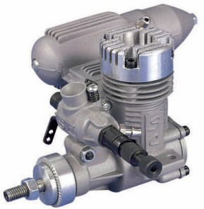
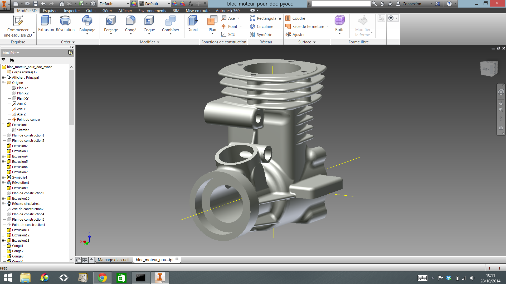
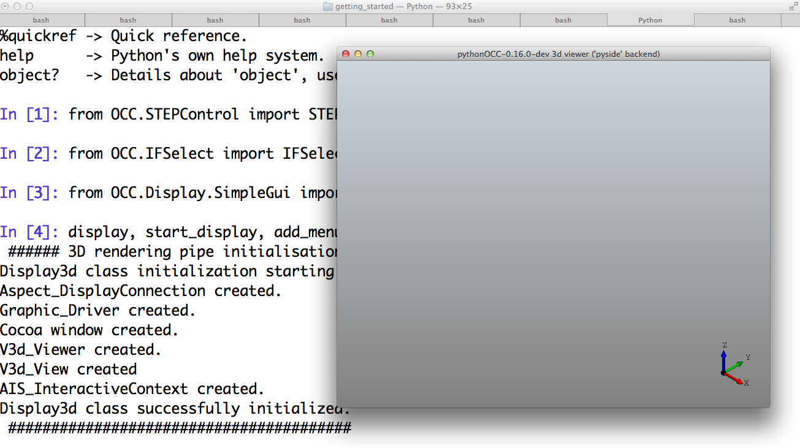
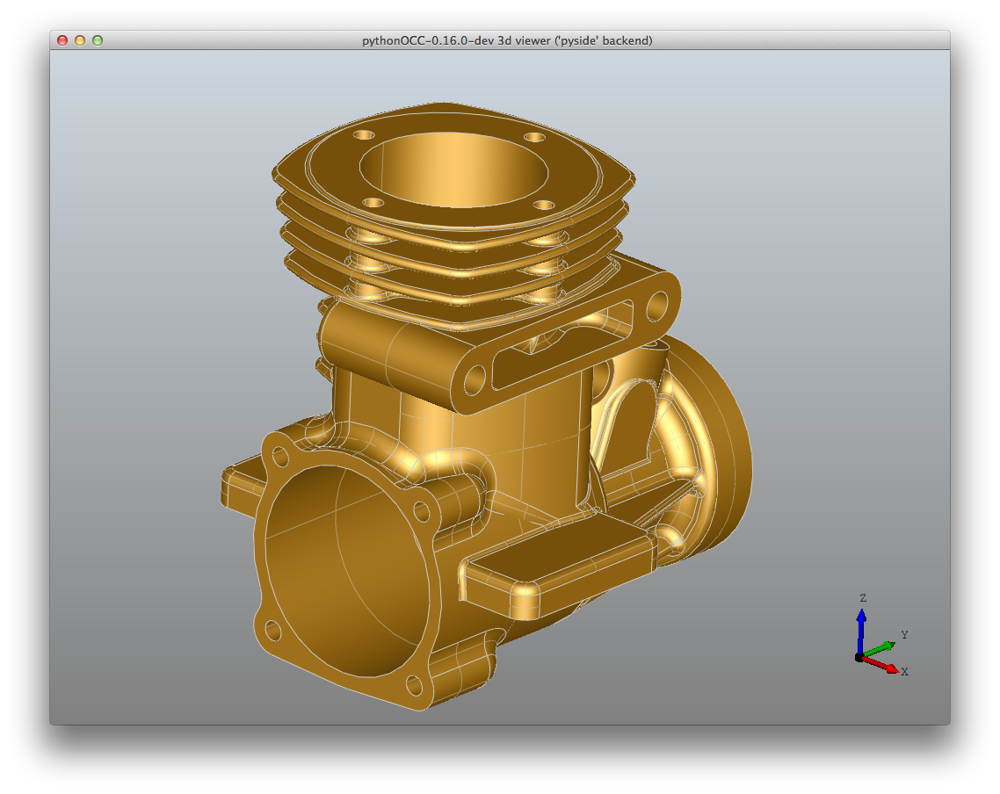
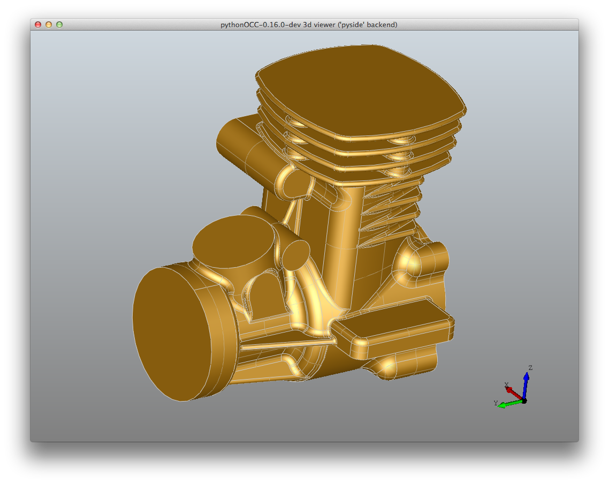
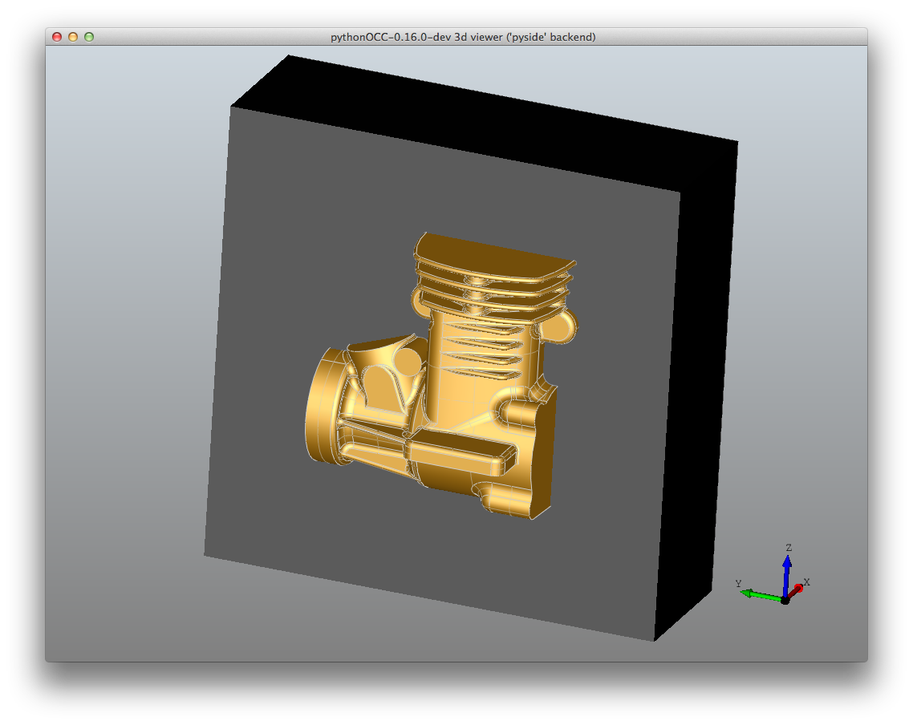
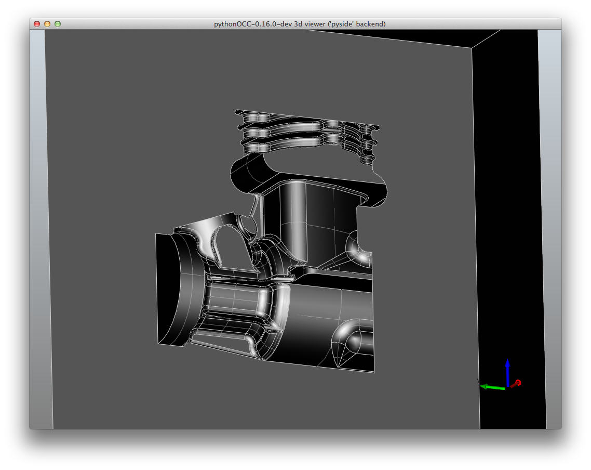
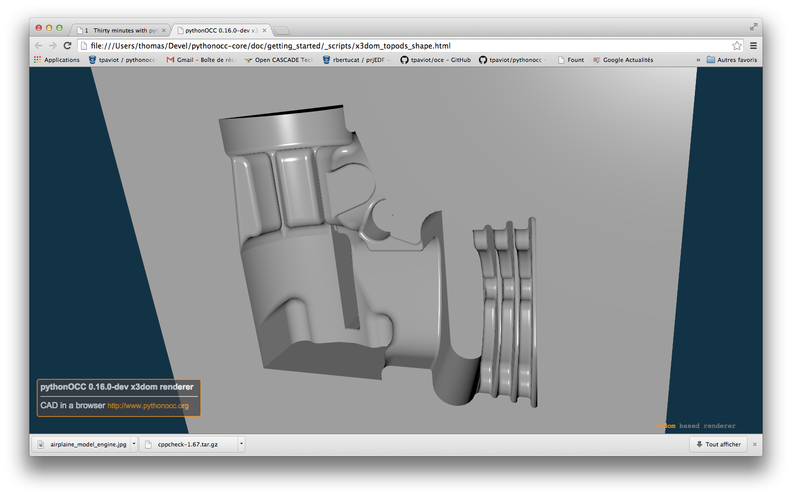

Thirty minutes with pythonocc
=============================

In this section, you will discover, in less than 30 minutes, a set of features that covers the following fields: data import from a STEP AP 203 file, modeling a box, perform a boolean operation (cut), visualize a shape and render in WebGl.

This tutorial is based upon the ipython console: the 'qt' ipython mode allows an interactive session with pythonocc, without worrying about gui/event management/program freeze comming along. 

The use-case
------------

The use case suggested comes from a current situation in the industry: you're a manufacturing engineer, specialized in molding, receiving a 3d model for which you have to design the mold.  Your customer needs your skills to produce a set of 10.000 engines block, as you can see on figure :ref:`model_engine` .

.. _model_engine:

Your customer uses a famous CAD package to design its products: Autodesk Inventor Professional 15 (see image 2).

Import a standard file and display a shape
------------------------------------------

Launch the ipython environnement
^^^^^^^^^^^^^^^^^^^^^^^^^^^^^^^
::

  $ ipython --gui='qt'

You should have a python prompt.

Import the STEP file
^^^^^^^^^^^^^^^^^^^^

The customer sent to you, via an email, a 2.2Mb step file:  :download:`cylinder_block.stp<_models/cylinder_block.stp>`, generated with Autodesk Inventor (Note: most CAD vendors provide this feature).

A **STEPControl_Reader** instance is necessary to read/import STEP files::
  >>> from OCC.STEPControl import STEPControl_Reader
  >>> step_reader = STEPControl_Reader()
  >>> step_reader.ReadFile('../_models/cylinder_block.stp')
  >>> step_reader.TransferRoot()
  >>> block_cylinder_shape = step_reader.Shape()
      ...    Step File Reading : ../_models/cylinder_block.stp
      ...    STEP File   Read    ... 
  Elapsed time: 0 Hours 0 Minutes 0.056925 Seconds 
  CPU user time: 0.04 seconds 
  CPU system time: 0 seconds 
      ... Step File loaded  ... 
  Elapsed time: 0 Hours 0 Minutes 0.110026 Seconds 
  CPU user time: 0.09 seconds 
  CPU system time: 0.01 seconds 
   54737 records (entities,sub-lists,scopes), 171664 parameters
      ... Parameters prepared ... Elapsed time: 0 Hours 0 Minutes 0.158572 Seconds 
  CPU user time: 0.13 seconds 
  CPU system time: 0.01 seconds 
  Report : 4 unknown entities
      ...   Objets analysed  ... 
  Elapsed time: 0 Hours 0 Minutes 0.239736 Seconds 
  CPU user time: 0.21 seconds 
  CPU system time: 0.02 seconds 
  STEP Loading done : 31486 Entities

STEP file was successfull. Let's now display the shape in the graphic window.

Display the block engine shape
^^^^^^^^^^^^^^^^^^^^^^^^^^^^^^
First import the module providing a basic qt based gui ::

  >>> from OCC.Display.SimpleGui import init_display

Then initialize the graphic window ::

  >>> display, start_display, add_menu, add_function_to_menu = init_display()
  ###### 3D rendering pipe initialisation #####
  Display3d class initialization starting ...
  Aspect_DisplayConnection created.
  Graphic_Driver created.
  Cocoa window created.
  V3d_Viewer created.
  V3d_View created
  AIS_InteractiveContext created.
  Display3d class successfully initialized.
  ########################################

You should now see a graphic window, empty, with just a rvb triedron at the lower right corner.

Just pass the blocke_engine_shape to the display, and ask for a refresh ::

  >>> display.DisplayShape(block_cylinder_shape, update=True)

You can see the cylinder block shape, in a light orange color.

Using your mouse you can:
* left click and move to rotate
* right click and move to pan
* middle click (or mouse wheel) and move to zoom in/out.

You can also :
* type 'a'/'b': enable/disable antialiasing
* type 'w'/'s': switch from wireframe to shaded representation modes

A lot more things can be customized though.

Create the mold print using a boolean cut operation
---------------------------------------------------

Loads the step file
^^^^^^^^^^^^^^^^^^^
Reproduce the previous steps from scratch, import and display the step file :download:`cylinder_block_mold_model.stp<_models/cylinder_block_mold_model.stp>`. It is the shape
from which the mold will be created.

Create the mold basis: a box
^^^^^^^^^^^^^^^^^^^^^^^^^^^^
We need the **BRepPrimAPI_MakeBox** class to create the box, then a transformation to move it along the y and z axis ::

  >>> from OCC.BRepPrimAPI import BRepPrimAPI_MakeBox
  >>> from OCC.gp import gp_Vec, gp_Trsf
  >>> from OCC.BRepBuilderAPI import BRepBuilderAPI_Transform
  >>> box = BRepPrimAPI_MakeBox(30, 90, 90).Shape()
  >>> trns = gp_Trsf()
  >>> trns.SetTranslation(gp_Vec(0, -35, -35))
  >>> mold_basis = BRepBuilderAPI_Transform(box, trns).Shape()

The mold basis is created, let's display it with another material ::

  >>> from OCC.Graphic3d import Graphic3d_NOM_STEEL
  >>> display.DisplayShape(mold_basis, update=True, material=Graphic3d_NOM_STEEL)
    
And here is what we obtain

Compute the mold print
^^^^^^^^^^^^^^^^^^^^^^
We have to perform a boolean cut operation between the box and the block. This is achieved using the **BRepAlgoAPI_Cut** class ::

  >>> from OCC.BRepAlgoAPI import BRepAlgoAPI_Cut
  >>> mold = BRepAlgoAPI_Cut(mold_basis, block_cylinder_shape).Shape()

Display the result, but first erase what is curently displayed

  >>> display.EraseAll()
  >>> display.DisplayShape(mold, update=True, material=Graphic3d_NOM_STEEL)

Here we are!

At last, display the shape in the browser
^^^^^^^^^^^^^^^^^^^^^^^^^^^^^^^^^^^^^^^^^

Imagine you want to share the shape with someone would don't have any CAD software installed,
of no STEP or CAD file viewer. Let's provide him a single html page he will be able to view in it's web browser, without any plugin. For that, we will use the x3dom renderer.

  >>> from OCC.Display.WebGl import x3dom_renderer
  >>> my_webgl_renderer = x3dom_renderer.X3DomRenderer()
  >>> my_webgl_renderer.DisplayShape(mold)

Your default webbrowser will display the generated html page: handle the 3D model the same way you did it in the qt based window.

Conclusion
==========
There are **many** **many** more features available in pythonocc. To go further, here is what you can do:

  - go to the /examples folder and run/study/modify what you see,

  - read the api documentation,

  - ask questions to pythonocc@googlegroups.com,

  - check oce.

Please report to tpaviot@gmail.com any comment or suggestion to improve this document.
